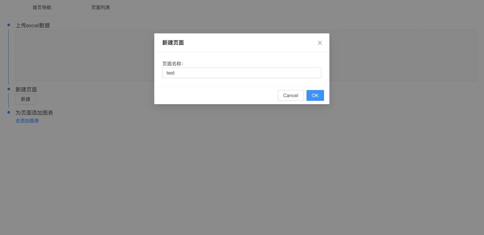
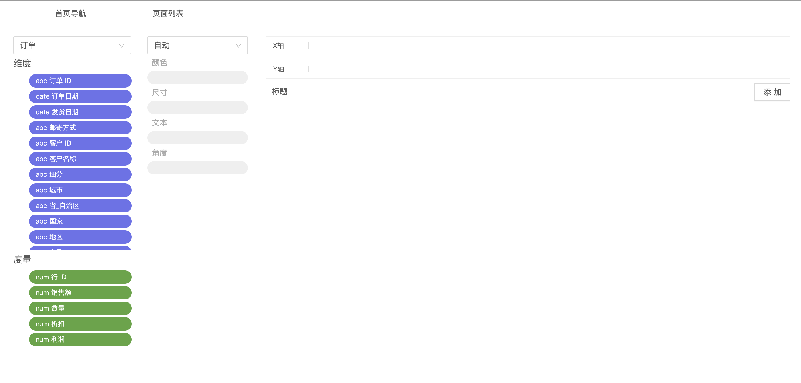
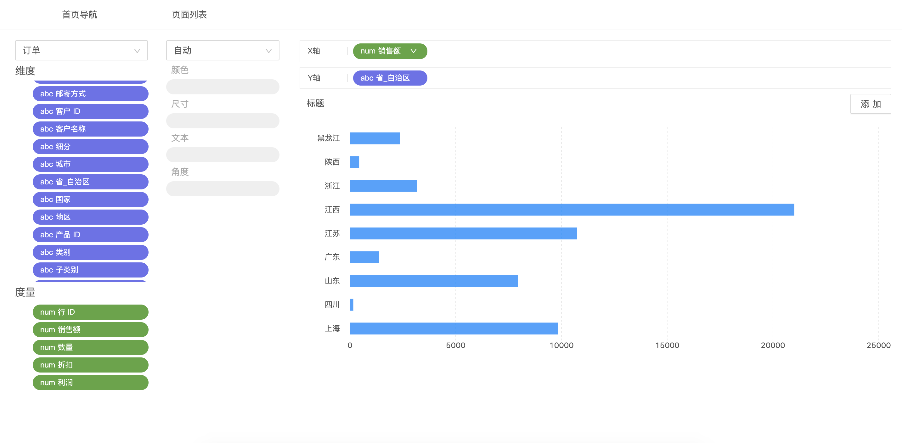
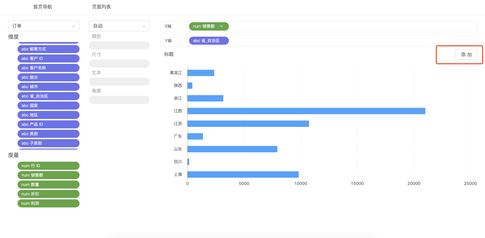
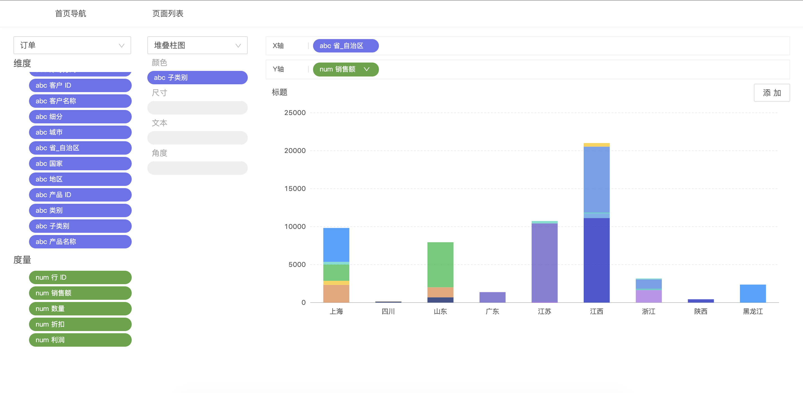
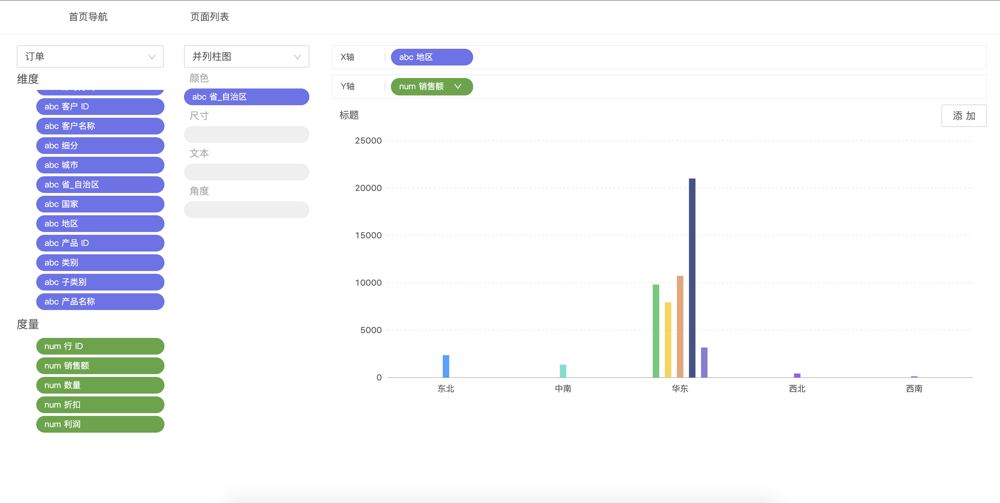
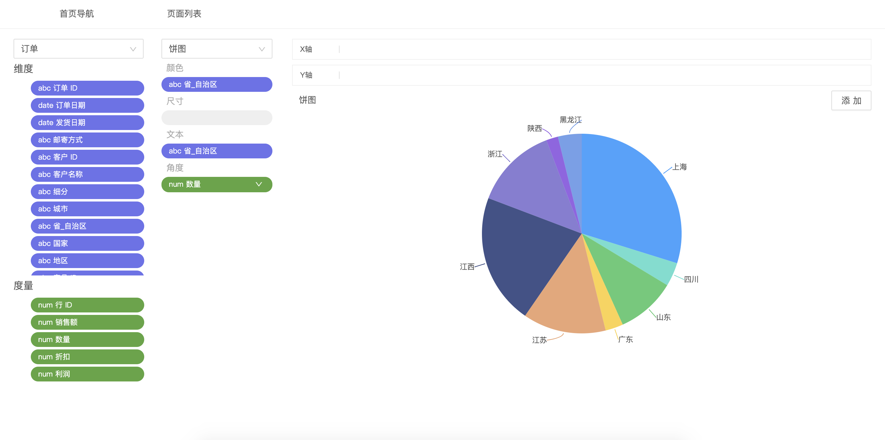
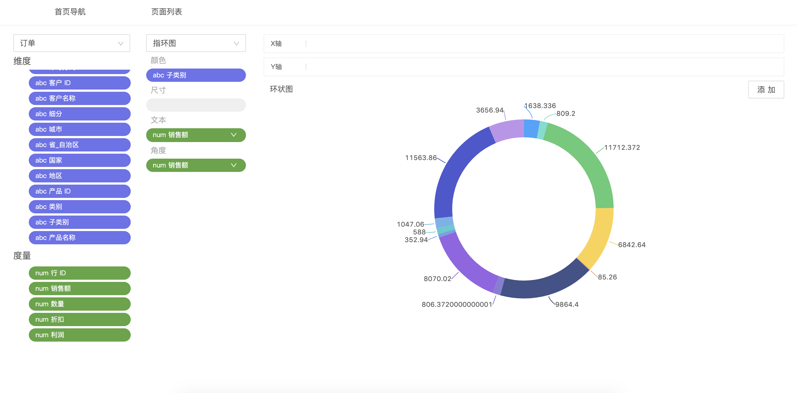
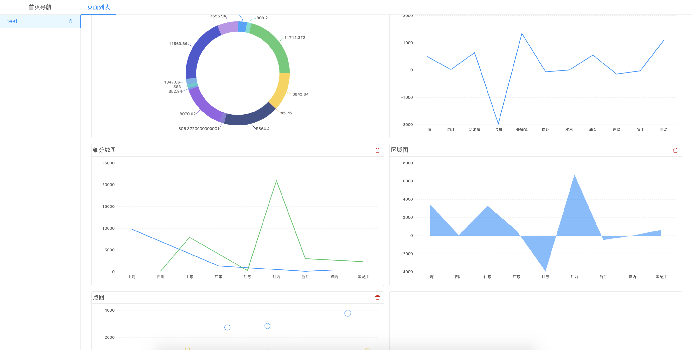

# 离线BI分析（简单版）

`git clone git@github.com:lidasong/easy_local_bi.git`

`npm install`

`npm start`

[127.0.0.1:8000](127.0.0.1:8000)

## what is it
  根据excel文件内容，基于websql本地生成对应的表结构

## demo
  https://lidasong.github.io/mugong/bi

## how to use

### first

upload your wanting analyze data source by excel file
[demo excel](./示例 - 超市.xlsx)

after upload the excel you can then make a page

### second

click `新建` to create a page

### third
now you in the created page, then you can add some charts to the page.

click the add panel

### fourth
get to the add page, make charts,

for example i create a bar chart

### fifth

when the chart created, you then add the chart to you page.
click the `添加` button

and after you clicked, you'll be at the added page

## charts

### bars

#### normal

#### stack

#### align

### pie

#### normal

#### circle

## overall

after you finish you page, switch to that, you'll find the whole content

## Issues

cause the program at github, there are some limits, routers/accessibility/...

